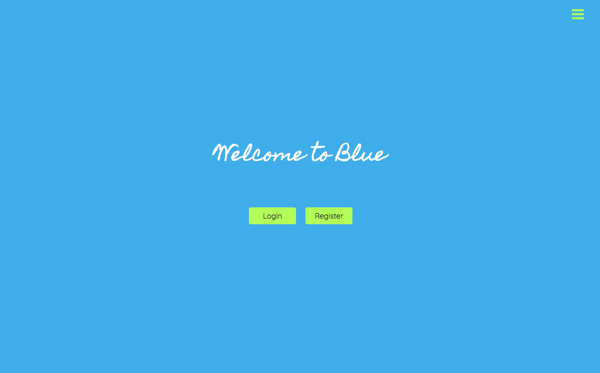
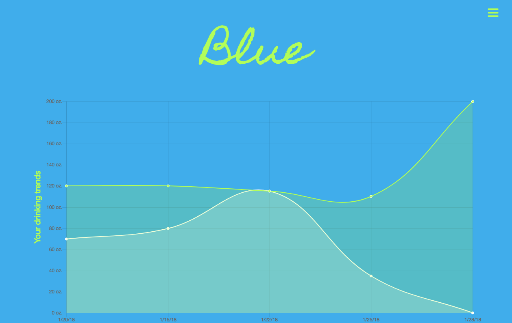
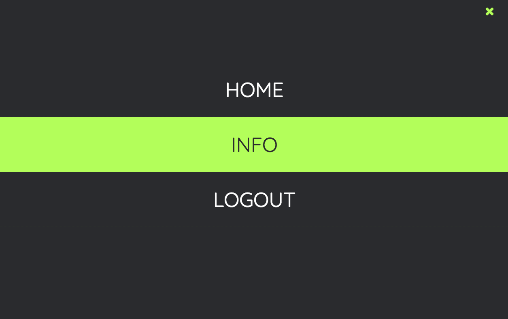

# Blue-App
Blue is an app that tracks your hydration. It is designed for anyone looking to improve their health and stay accountable to their goals.

The way this works is simple. First, create an account. Second, create a daily entry. Your daily entries will keep you accountable day by day to see if you're reaching your water intake goal. Lastly, when you drink water through out the day, go to you daily entry by clicking on the entry date in the home page table, then input how much you drank to see your progress.

Each time you create a daily entry, you will see it added to your home page chart. This chart will help you keep track of your drinking trends.







## Getting Started

Start by registering your account. To view an example user's account and features, use the login information below.
```
username: gunny
password: gunny
```

### Pre-Requisites, Installation and Tests

No installation is needed to run the app. A user must simply register and login.


## Deployment
I utilized the Heroku cloud platform to deploy my application model. To view it live, visit:
[Blue](https://blueagua.herokuapp.com/)


## Built With

* **Express** - *Used to create the backend API.*
* **Angular** - *Used to create the application pages.*
* **Mongoose** - *Used to create and manage the data.*
* **Mongo** - *Used to create and manage the data.*
* **HTML** - *Used with angular.*
* **JavaScript** - *Used with Angular and Express.*
* **[Chart.js](http://www.chartjs.org/docs/latest/)** - *Used with Angular and Express.*
* **[Angular-Chart.js](http://jtblin.github.io/angular-chart.js/#getting_started)** - *Used with Angular and Express.*
* **CSS** - *Used to add style the pages.*
* **[Bootstrap](https://getbootstrap.com/)** - *Used to add style the pages.*
* **[Animista](http://animista.net/)** - *Used to add CSS animations.*
* **Atom** - *Used as our text editor.*
* **Heroku** - *Used to deploy our app.*
* **[Font Awesome](http://fontawesome.io/)** - *Used for glyphicons on buttons.*


## Planning and Wireframes
Before starting this app, I planned out what I wanted users to be able to do, and what the purpose of the app would be. Upon deciding that, I wireframed what I wanted my pages to look like for each user. This helped me stay organize in my code, because I knew what data I wanted to display in each page, and what my routes would look like. Finally, after my backend was finished, I developed my frontend. This included researching what charts would work best with angular and the kind of data that I was dealing with.


## Updates and Future Goals
At the moment, this app only allows users to see their information. With more time, I would like to add the following functionalities that make this app more intuitive for the user, as well as give it a social aspect:

* **User Profile and Friending** - *This will allow users to friend each other, and see how they're friends are doing. This will increase the accountability purpose of the app, so that users can motivate each other to drink more water.*
* **Date Recognition/Sorting For Home Chart** - *A more complex structure to the charts, so that they are automatically sorted dates. This is so that if a user potentially creates an entry that is older than the previous entry, it  will be sorted in order by date on the chart rather than last entry created. Additionally, it would be ideal that the chart show the latest week, and change week by week, but users can see past weeks in an archived section.*
* **Drinking Challenges** - *This is another aspect of accountability and motivation. Users will be able to invite friends into a drinking challenge for the week, to see who can drink the most water or who reaches their goal the most.*
* **PR and rewards** - *This feature would allow users to see what day they drank the most water, and what days they reached their goal, and unlock something fun for them after a certain number of times that they've reached their goal. Example, after reaching their goal 30x, they unlock a free workout or healthy recipe.*
* **Forgot Password** - *A really useful functionality I would like to add in the future is an option to email users a new temporary password or implementing some other option that allows them to log in if they've forgotten their password.*

## Contributing

For contribution, email me, [Josefina Mancilla](josefinanoemi4@gmail.com).


## Authors
* **Josefina Mancilla** - [jnm2377](https://github.com/jnm2377)


## Acknowledgments

* StackOverflow.
